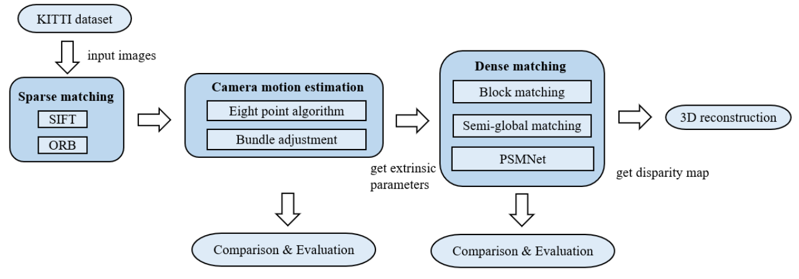

# Stereo Reconstruction
Authors: Dekai Zhu, Dongyue Lu, Qianyi Yang, Weihua Huang
## Dependency
- OpenCV 3.2
- Eigen 3
- g2o @ 9b41a4e

## Introduction 

 
Stereo reconstruction is a very active research field in computer vision, which has a wide range of applications in architecture capturing and autonomous driving. In this project, we apply different stereo matching methods to reconstruct 3D scenes and compare their performance. Based on key-point detectors and eight-point algorithm, we recover the camera's extrinsic and rectify the images from left and right camera for the next step. Then we apply three dense matching methods to generate the disparity map respectively and further reconstruct the 3D scene. 
We evaluate the impact of different detectors and bundle adjustment on the accuracy of the estimated transformation. The experiment shows that SIFT performs better than ORB, and the accuracy of the estimated transform is also improved after using bundle adjustment. For dense matching, with PSMNet, which is the SOTA in disparity prediction, we can get much higher precision than classic methods block matching and semi-global matching.

## Pipeline

 
We use KITTI dataset, which provides images of two RGB cameras and corresponding depth information. First, we apply key point detection methods, e.g. SIFT
and ORB to extract key points and find best matching pairs from left image and
right image. Based on matched point pairs we conduct eight-point algorithm to estimate the external parameters. Then we use bundle adjustment to further refine the
result. By computing the error of computed parameters with ground truth, we study
the performance of different detectors and camera motion estimation methods.
With extrinsics of the camera, we rectify the left image and right image. Due to
the insufficient precision of extrinsics we estimate, we also consider directly using the
rectified images provided in the dataset. Then we apply dense matching methods block
matching, semi-global matching and PSMnet to construct disparity map.
Finally, we use the disparity map to generate point cloud in 3D space by backprojection. We write a 3D mesh out of it and complete the reconstruction by triangulation. 

<!--  -->

## Result
### Sparse matching

 
We select 30 images from the KITTI2015 dataset as our test dataset and get their corresponding unrectified images from raw data.
We use ORB and SIFT to detect key points in left and right images, which are then used in eight-point algorithm to recover the rotation and translation between left and right images. Then we use bundle adjustment to improve the accuracy. For both SIFT and ORB, we choose 40 keypoint pairs in the image. As for bundle adjustment, we use the result from eight-point algorithm as initialization. For the evaluation of rotation matrix, we convert the rotation matrix into $zyx$ Euler angles and compute the mean squared error. For translation vector, we compute the mean squared error directly. The quantitative results are shown in Table 1.

 
Compared with ORB, the accuracy of the methods using SIFT is greatly improved, but in fact the calculation time of SIFT is slightly longer. In addition, the optimization effect of bundle adjustment is obvious.
But overall, the accuracy we obtained is very low, especially the translation vector, given that the baseline is only about 0.54 m. Such accuracy is not enough for us to obtain high-quality rectified images. Considering that our focus is to compare the performance of different stereo matching methods, we decide to use the rectified images provided by the dataset to do the follow-up work.

### Dense matching

 
We use the rectified images provided in  KITTI2015 dataset to get disparity maps with 3 different methods, namely block matching, semi-global matching and PSMNet. For evaluation, we calculate an error rate, that is the percentage of error pixels to all valid pixels. And an error pixel means the difference between calculated disparity value and ground truth is greater than 3 pixels and greater than 5\%. The qualitative results 
are shown in Figure 2, the first row shows our disparity map, the second row shows the ground truth, and the third row shows the difference between our result and ground truth.

 
For comparison, we calculate the average error rate for each method. From Table 2, we know that PSMNet works best, it can ensure that nearly 99% of pixels have an disparity error within 5% or under 3 pixels. While block matching has the worst effect, only half of the pixels have lower disparity error.

 
After getting disparity map, we can calculate depth and get 3D points, then we can generate 3D meshes by triangulation. Figure 3 gives an example of our mesh reconstruction result.

## Conclusion 

 
In this project, we achieve a pipeline of stereo reconstruction and compare different methods in sparse matching and dense matching. For sparse matching, in general, SIFT runs slower but provides higher accuracy than ORB. With bundle adjustment we can achieve better accuracy than eight point algorithm, but none of these methods we tried can be accurate enough to be applied in subsequent stereo matching, which can be further improved in future work. For dense matching, semi-global method achieves considerable gain compared with block matching in accuracy and speed, but deep learning method outperforms greatly classic methods.

